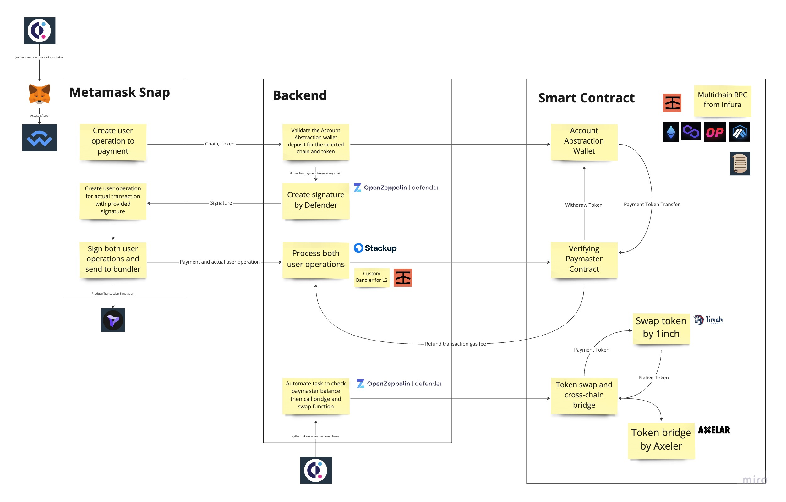

# 2023-eth-denver-submission

This is the 2023 ETH Denver submission repository

<Key visual image comes here>

## Product Description

<Service Name> provides a seamless and secure user experience by leveraging a range of third-party services. The core of the service is built on top of zkSync, and uses the following third-party services to enable multichain support, token bridging, and token swapping:

## How it works

<Service Name> leverages a range of third-party services to provide a seamless and secure user experience. The core of the service is built on top of zkSync, and uses the following third-party services to enable multichain support, token bridging, and token swapping.

### Metamask Snap

Metamask Snap is an extension function of the Metamask that enables the addition of the Account Abstraction function to Metamask.

- [Setup and investigation of Metamask Snap with Truffle Box](https://github.com/taijusanagi/2023-eth-denver-submission/issues/3)

### Defender

Defender creates a signature for verifying paymaster contract, and automates multichain deposit syncing.

- [Investigation of Defender](https://github.com/taijusanagi/2023-eth-denver-submission/issues/2)

### Axelar

Axelar sends USDC and native tokens to other chains.

### 1inch

1inch swaps USDC to a native token.

### ChainLink

ChainLink is used to get price data into the blockchain, providing up-to-date information for token swaps.

### Infura & Truffle

Infura is a multichain node service that is used to deploy multichain contracts.
And Truffle is a core development tool in our team and provides a starter kit for Metamask Snap.

https://github.com/taijusanagi/2023-eth-denver-submission/blob/main/docs/infura-truffle.md

By working together, these services provide a seamless and secure user experience, allowing users to interact with dApps across multiple chains without having to worry about the complexities of managing tokens across different chains.

## Benefits

### Simplified user experience

<Service Name> eliminates the need for users to manage tokens across multiple chains with bridge and swap, making it simple and easy for users to interact with dApps across multiple blockchains.

### Increased accessibility

<Service Name> makes it possible for a wider audience to participate in the rapidly growing crypto ecosystems, eliminating barriers to entry and making blockchain more accessible to a wider range of users.
