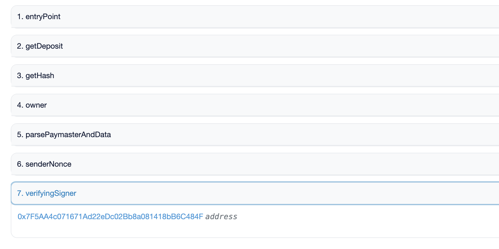
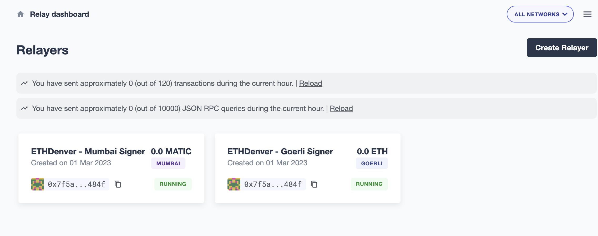

## Defender

Defender is an automated tool that verifies the signature within the paymaster contract, checks the paymaster deposit balance, and facilitates any necessary fund transfers. CrossFuel has chosen Defender because it requires a stable infrastructure for signing and health checks.

### Verifiying Paymaster Signer Key with Relayer

We are using the Defender relayer key as the signer in the Verifying Paymaster Contract. The address 0x7f5aa4c071671ad22edc02bb8a081418bb6c484f is used to verify the paymaster signer key and fund manager.

Defender only signs when the user creates enough gas payment, and the Verifying Paymaster checks the off-chain signature created by Defender. This is the core function of cross-chain gas payment.

By enabling the "Clone to another network" option, we can use the same signing key for multiple chains. This is highly beneficial as the address used can impact the deployed paymaster contract's address.

## Paymaster Balance Tracking with Autotasks

We use the Defender auto task to monitor paymaster deposits in the Account Abstraction entrypoint. This is essential to ensure that there is always sufficient deposit available.

1. Check the paymaster deposit balance and send a notification to the admin if the balance is too low.

2. The admin can run a sync function to fund the account.
