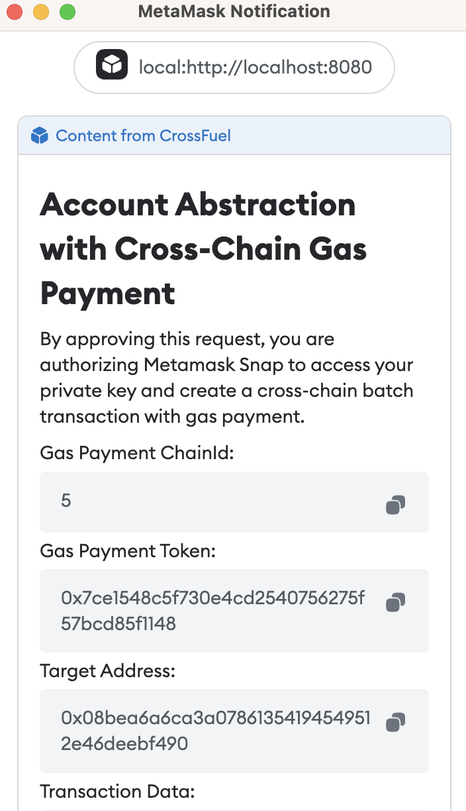
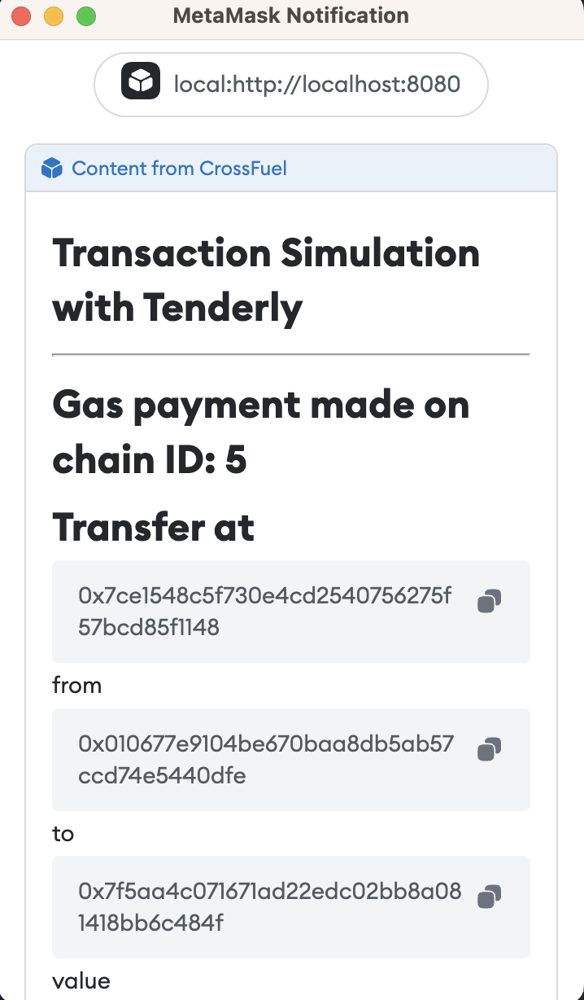

## Metamask Snap

Metamask Snap simplifies the Account Abstraction function by automating the signature process and providing a transaction simulator for improved security. This extension feature of Metamask enhances the user experience by eliminating the need for multiple signatures, which was previously cumbersome and difficult to comprehend.

To create a project template, we utilized the Metamask Snap Truffle Box, which can be found at https://github.com/taijusanagi/2023-eth-denver-submission/tree/main/implementations/metamask-snap.

## Scalability & Improved User Experience with Metamask Snap

n this application, the user creates two transactions - one for cross-chain gas payment and one for the actual transaction. Both transactions utilize Account Abstraction verifying paymaster function, which previously required the user to sign four times.

To improve the user experience, we utilize snap_getBip44Entropy to enable the user to sign four times in one prompt, making the process smoother and more seamless. This reduces network workload and enables a cross-chain gas payment model.

## Security

To ensure security, we leverage Tenderly to mitigate security risks and guarantee the safety of the application. The transaction simulator feature in Tenderly allows us to test the application's functionality without deploying it on the live network.

