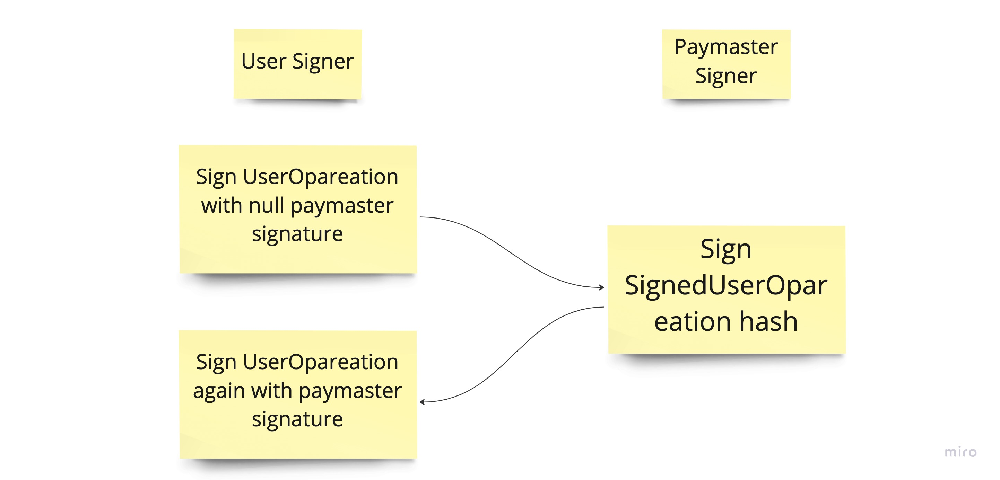

## Truffle Box for Metamask Snap

We utilized the Metamask Snap Truffle Box to create a project template, which can be found here: https://github.com/taijusanagi/2023-eth-denver-submission/tree/main/implementations/metamask-snap.

For more details on the initialization of the Metamask Snap Truffle Box, please see here: https://github.com/taijusanagi/2023-eth-denver-submission/issues/3.

## Improved User Experience with Metamask Snap

In this application, the user creates two transactions: one for cross-chain pay for gas and one for the actual transaction. Both transactions utilize Account Abstraction verifying paymaster function, which requires the user to sign twice on the user operation.

So in total, the user needs to sign four times!

To improve user experience, we are utilizing snap_getBip44Entropy to have control over user private key and sign four times in one prompt, making the process smoother and more seamless for the user.

## Security

We are utilizing Tenderly to reduce security risks and ensure the safety of the application.
