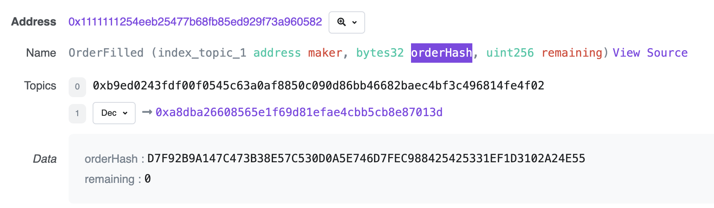
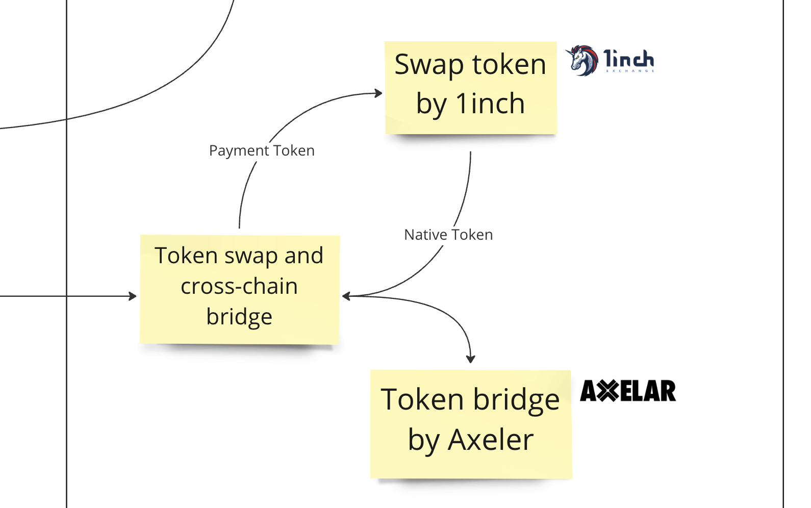

## Tested Code

https://github.com/taijusanagi/CrossFuel/blob/main/implementations/metamask-snap/packages/truffle/scripts/fusion.ts

## Tested Order

```
{
  order: {
    salt: '45239446712580941425315762928166993846168085507702969839221695984480330714670',
    makerAsset: '0x0d500b1d8e8ef31e21c99d1db9a6444d3adf1270',
    takerAsset: '0x2791bca1f2de4661ed88a30c99a7a9449aa84174',
    maker: '0xa8dba26608565e1f69d81efae4cbb5cb8e87013d',
    receiver: '0x0000000000000000000000000000000000000000',
    allowedSender: '0x1e8ae092651e7b14e4d0f93611267c5be19b8b9f',
    makingAmount: '500000000000000000',
    takingAmount: '493795',
    offsets: '970558080243398695134547109586957793750899628853613079895592438595584',
    interactions: '0x63592c2b0000000000000000000000000000000000000000000000000000000064049f68000601c55c000000008acdb3bcc5101b1ba8a5070f003a77a2da376fe8000000000000000000000000000000000000000000000000000000000000000000000000000000000000000000000000000000002eb393fbac8aaa16047d4242033a25486e14f34500000000c6c7565644ea1893ad29182f7b6961aab7edfed0f486570029'
  },
  signature: '0xa085fcd270c1696d8d685fd4e189c75fcf3eb143be490db372f28eb39e0275ea7ddc8239115534e2ac17fa9205dbf9bce9a3c3f9d4d99deb3b5153145111a0271b',
  quoteId: '0207e5c5-81cc-4f7f-9f61-f59ca0d07344',
  orderHash: '0xd7f92b9a147c473b38e57c530d0a5e746d7fec988425425331ef1d3102a24e55'
}
```

## Tested Transaction

https://polygonscan.com/tx/0xc7065ea6808451eae9dcd327e14d317b3ce1be9e151500f3b9a4156e1165325f

## Get Transaction Hash from Event



## How We Utilize the 1inch fusion



Swapping and bridging tokens through platforms like 1inch and CrossFuel can offer numerous benefits for users in the decentralized finance (DeFi) ecosystem. Here are some additional benefits:

Increased Liquidity: By swapping tokens, users can increase liquidity for both tokens in the DeFi ecosystem. This makes it easier for users to buy and sell their preferred tokens without having to worry about low liquidity.

Lower Fees: Swapping tokens through DeFi platforms typically incurs lower fees than traditional centralized exchanges, which can be especially beneficial for small transactions.

Access to a Wide Range of Tokens: DeFi platforms like 1inch and CrossFuel offer access to a wide range of tokens, including those that may not be available on centralized exchanges. This opens up new opportunities for investors and traders.

Increased Security: Decentralized exchanges are often considered more secure than centralized exchanges because they do not store user funds in a centralized location. Instead, funds are held in smart contracts, which can only be accessed through a user's private key.

Gas-Less Architecture: CrossFuel's gas-less architecture can significantly reduce transaction fees for users. This can be especially beneficial during times of high network congestion when gas fees on other DeFi platforms can be prohibitively expensive.

Overall, swapping and bridging tokens through DeFi platforms can offer a range of benefits for users, including increased liquidity, lower fees, access to a wider range of tokens, increased security, and reduced transaction fees through gas-less architecture.
