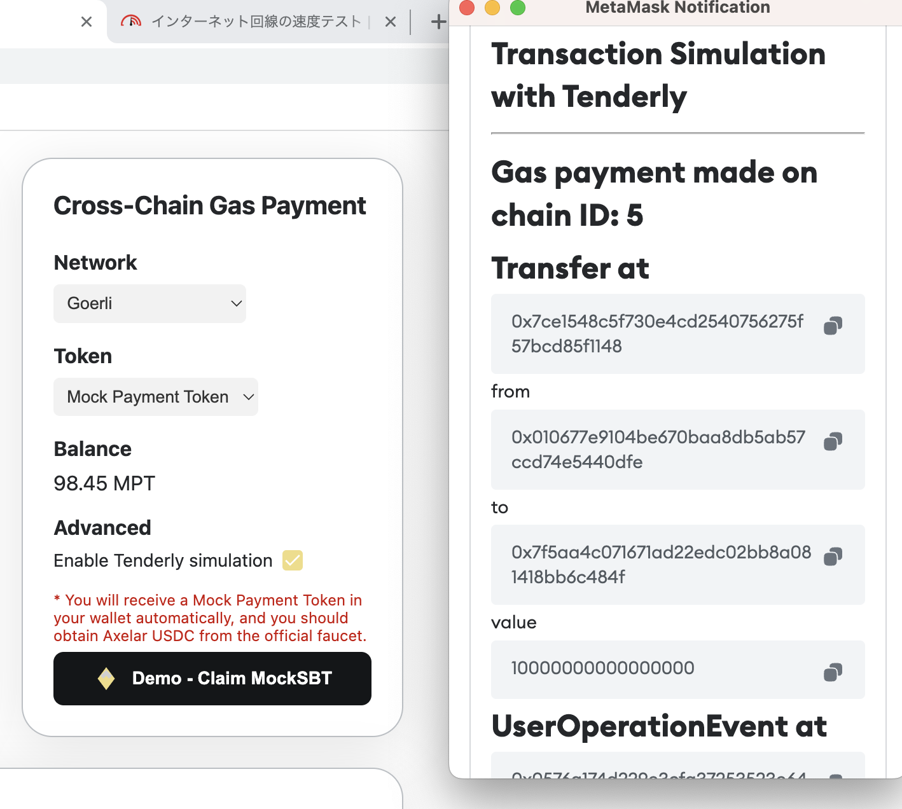
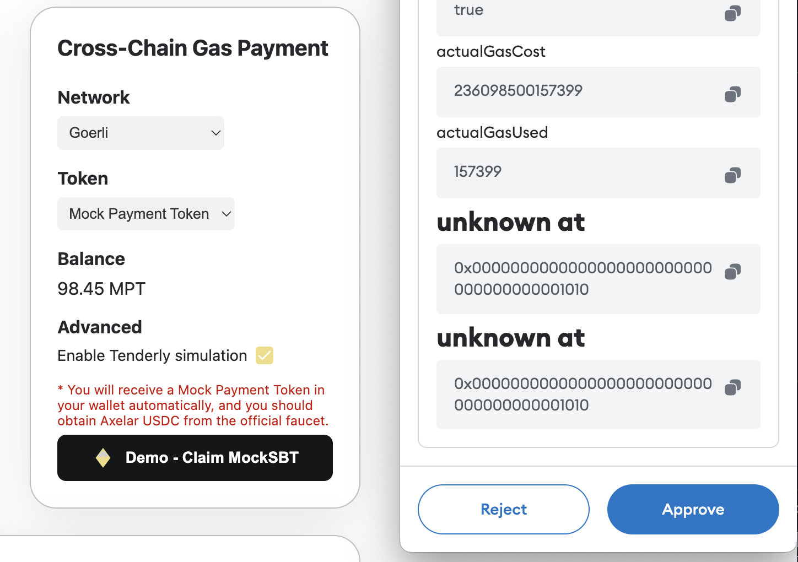
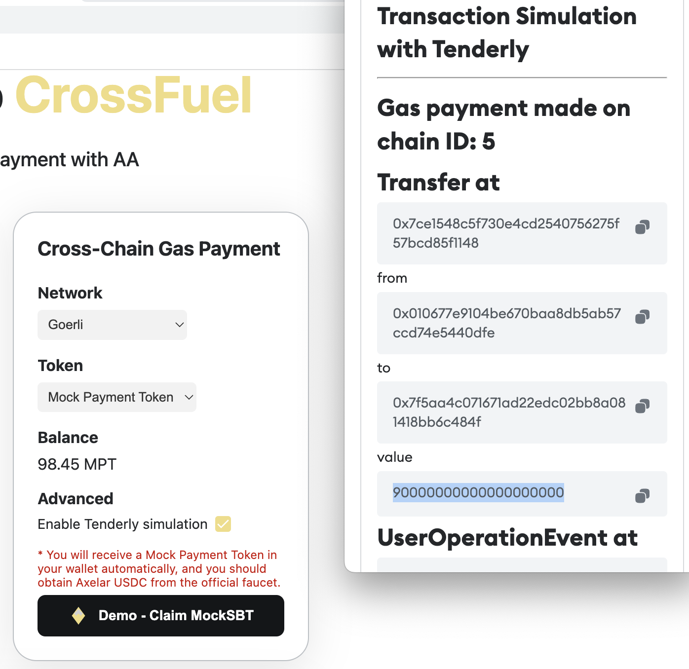
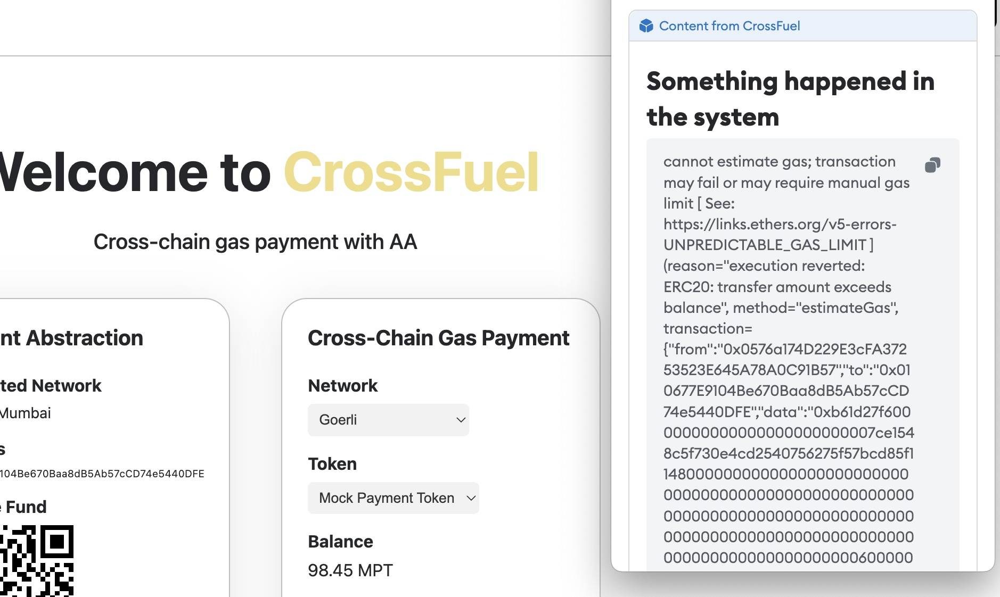

### Tenderly

Communicating the inner workings of Account Abstraction to users is challenging. To enhance the user experience, we're using Tenderly to simulate transaction results. This allows users to review the transaction outcome before submitting it to the bundler, thereby ensuring the security of the process. This security feature is critical in making the Account Abstraction wallet widely accepted.

### Bounty

We've chosen option 1, which allows users to discard unwanted transactions in the dapp UI. Our UI, developed with Metamask snap, displays relevant information about transaction execution, including event logs. Users can either approve sending the transaction to the chain or discard it.

### Displayed Simulation

We parse the event log to show users what will occur when they approve the transaction.

The user has the option to choose whether or not to proceed with the transaction.

We calculate the payment token amount based on the gas fee and conversion rate, but if the user is unsatisfied with the result, they can decline the transaction.

Prior to simulation, we perform a failure check. If Tenderly encounters an error, an error screen is displayed.

